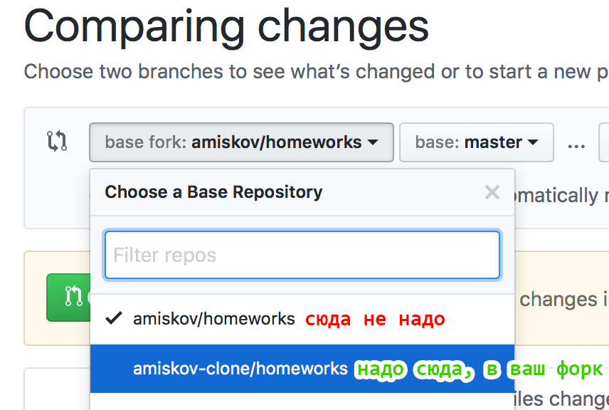

# Порядок выполнения заданий
В примерах ниже пользователь `amiskov` выдает и проверят задачи, `amiskov-clone` их выполняет.

## 1. Форкните этот репозиторий
Нажмите кнопку , у вас в профиле появится своя собственная копия этого репозитория. Склонируйте его себе на компьютер.

## 2. Добавьте проверяющего в коллабораторы
Коллабораторы — это те, кто может вносить изменения в репозиторий. Добавив проверяющего в коллабораторы вы даете ему возможность вносить изменения в файлы вашего форка (оставлять комментарии, одобрять пул-реквесты):

Проверяющему придет письмо с инвайтом, он его подтвердит и все будет готово к работе.

## Порядок выполнения заданий
В ветке `master` вашего форка должен быть _только проверенный и исправленный код_! Каждая задача должна выполняться в своей собственной ветке.

Например, нужно сделать задачу из папки `/city-selector` (в ней лежит соответствующее описание и шаблон). Ваши действия:

1. Создайте ветку `homework_city-selector`.
2. Решите задачу в этой ветке, запуште изменения.
3. Создайте пул-реквест из `homework_city-selector` _в свою ветку `master`_. По умолчанию Гитхаб предложит вам сделать пул-реквест в основной репозиторий (не форк), а вам нужно выбрать именно свой форк:

После создания пул-реквеста сообщите об этом проверяющему. Он проверит, напишет замечания и вы сможете поправить код. Если замечаний нет, проверяющий одобрит пул-реквест и проверенный код окажется в вашей ветке `master`.

Задача считается выполненной, когда вы исправите все замечания и проверяющий одобрит пул-реквест.

## Обновление форка из основного репозитория
TBD